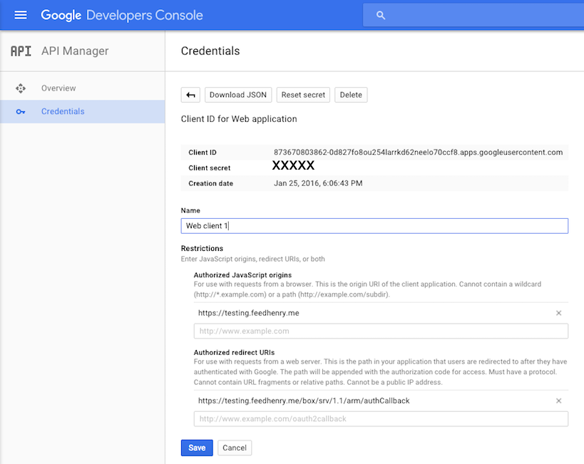

# oauth-ios-app [](https://travis-ci.org/feedhenry-templates/oauth-ios-app)

```oauth-ios-app``` is a simple to demo OAuth2 usage in RHMAP (Red Hat Mobile Application Platform).

|                 | Project Info  |
| --------------- | ------------- |
| License:        | Apache License, Version 2.0  |
| Build:          | cocoapods  |
| Xcode:  | 7.X|
| iOS:  | iOS7, iOS8, iOS9|
| Language:  | Objective-C|
| Documentation:  | http://docs.feedhenry.com/v3/dev_tools/sdks/ios.html, http://docs.feedhenry.com/v3/product_features/admin.html#admin-auth_policies|

### Build

1. Clone this project

2. Populate ```FHAuthDemo/fhconfig.plist``` with your values as explained [here](http://docs.feedhenry.com/v3/dev_tools/sdks/ios.html#ios-configure).
3. pod install

4. open FHAuthDemo.xcworkspace

## Example Usage

### Set up Google provider
To set up the example to worl with Gloogle OAuth2 provider, go in:

* [Google dev console](https://console.developers.google.com/):
Create a web credentials, add the callback URL as shown below:


* in RHMAP:
Go to ```Admin > Auth Policies```, select the ```Create``` button.


### Set up FHAuthDemo

In ```FHAuthDemo/FHLoginViewController.m```:

```
- (void)viewDidLoad
{
  self.navigationItem.title = @"Login With ...";
  [super viewDidLoad];
  AuthMethod* googleauth = [[GoogleAuthMethod alloc] initWithName:@"Google OAuth" icon:@"auth_google" policyId:@"Google"]; // [1]
  self.authMethods = @[googleauth;
    
  [authList reloadData];
}
```

[1] Make sure ```Google``` matches the name you entered in RHMAP configuration.

### Running the app


